# Creditly

This project is a monorepo for a lending workflow prototype: internal staff manage **accounts** and **auctions**, while **bankers** participate in **blind** rate auctions without receiving customer-identifying data through the public API. The stack is **Express + Prisma + PostgreSQL** (API) and **Next.js App Router** (web), with an in-process event bus for reactions after persisted **`Event`** rows (account audit trail) and related bus notifications.

---

## Monorepo layout

| Package | Role |
| -------- | ---- |
| `backend/` | REST API, auth, RBAC, Prisma, domain services, in-process event bus |
| `frontend/` | Next.js UI, React Query, role-aware navigation and pages |

Each package installs and runs independently. The browser talks to the API via `NEXT_PUBLIC_API_URL` with credentials enabled for refresh cookies.

---

## Getting started

**Database**

```bash
cd backend
npm install
npm run db:up
npm run db:push
npm run db:seed
npm run dev
```

Default API: `http://localhost:3001` (see `backend/.env.example` for `DATABASE_URL`, `JWT_SECRET`, `CORS_ORIGIN`, token TTLs).

**Frontend**

```bash
cd frontend
npm install
npm run dev
```

Set `NEXT_PUBLIC_API_URL` in `frontend/.env` to the API origin (see `frontend/.env.example`).

---

## Scripts (reference)

| Location | Command | Purpose |
| -------- | ------- | ------- |
| `backend` | `npm run dev` | API with reload |
| `backend` | `npm run build` / `npm start` | Compile and run production |
| `backend` | `npm run test` | Vitest suite under `backend/tests/` (see **Testing** below) |
| `backend` | `npm run lint` / `npm run format` | ESLint / Prettier |
| `backend` | `npm run db:up` | Local Postgres (Docker Compose) |
| `backend` | `npm run db:push` | Apply schema (`prisma db push`) |
| `backend` | `npm run db:seed` | Seed demo data |
| `frontend` | `npm run dev` | Next.js dev server |
| `frontend` | `npm run build` / `npm start` | Production build and run |

`npm run build` in the backend runs **`prisma generate`** before **`tsc`**.

---

## Testing

The backend ships a **Vitest** suite (`cd backend && npm run test`). Tests are **unit-level** with **repository and integration boundaries mocked** so they run quickly without a database, while still exercising services, RBAC helpers, validation, and CRM orchestration.

**Why these areas are covered**

- **RBAC and data scope** — Wrong role or wrong account access is a security and compliance defect. Tests assert bankers cannot use staff account APIs, users and managers only see in-scope accounts, and event APIs reject disallowed roles.
- **Banker data minimization** — Offer responses must not leak `accountId` or customer identifiers to the banker client; a mapper test locks that contract.
- **Auction rules** — Submitting offers on non-open or expired auctions must fail with stable error codes; this protects integrity and matches UI expectations.
- **Synchronous event side effects** (`EventSideEffectService`) — `DOCUMENT_UPLOADED` transitions **`NEW` → `READY_FOR_AUCTION`** (and may emit **`STATUS_CHANGED`**), high-activity counts use a 24-hour window, winner selection uses lowest rate then earliest offer, and the win path can emit **`STATUS_CHANGED`** plus **`winning.offer.selected`**; these are central business rules.
- **Event-driven CRM** — **`CrmSyncService`** is tested with an injected **`{ push }`** stub (no real mock module); assertions cover success sync, failure persistence, unrelated event types, the winning-offer path, and listener wiring for **`registerCrmOnAccountEventCreated`**.

Together, the suite favors **short, readable tests** on **high-risk paths** rather than blanket coverage of every controller line.

---

## Environment

Secrets and deployment-specific values live in **`.env`** files, not in git. Copy **`backend/.env.example`** and **`frontend/.env.example`** and adjust for your machine or deployment.

Backend-only: **`CRM_FAILURE_RATE`** (0–1) tunes how often **`MockCrmApiClient.push`** throws in development; omit to use the default **0.35**.

## Architecture

The backend follows a **layered** structure so HTTP, use cases, and persistence stay separated:

- **`index.ts` / `app.ts`** — Process bootstrap: load env, register event-bus listeners once, create Express app, start jobs (for example refresh-token cleanup), listen on a port.
- **`modules/`** — Route factories: mount paths, stack middleware (`authenticateJWT`, `requireRole` / `requireRoles`), delegate to controllers.
- **`controllers/`** — Map HTTP to service calls; **path and query** inputs use **Zod** via **`parseParams`** / **`parseQuery`** where applicable (`validation/`).
- **`services/`** — Use cases and orchestration; **Zod** validates inbound JSON bodies where the service owns the contract (auth, events, open auction, submit offer).
- **`repositories/`** — Prisma access and query shapes; keeps SQL/ORM details out of services.


לפרט למה זה חשוב ומה היתרון - אולי לכתוב tradeoffs
- **`mappers/`** — API-facing DTOs (for example stripping fields for banker responses).
- **`event-bus/`** — Lightweight **in-process** pub/sub (`EventBus`: `on` / `emit`). Used for reactions after a row is written, not as a replacement for HTTP.
- **`middleware/`** — Auth, errors, request context.
- **`integration/crm/`** — **`CrmApiClient`** type and **`MockCrmApiClient`** (`mock-crm-api.client.ts`); **`CrmSyncService`** (`crm-sync.service.ts`) orchestrates pushes and account sync state. **`registerEventBusListeners`** wires **`MockCrmApiClient`**, **`CrmSyncService`**, **`registerCrmOnAccountEventCreated`**, and the winning-offer listener; controllers do not import this layer directly.
- **`jobs/`** — Scheduled in-process tasks.

The frontend uses the **App Router**, **React Query** for server state, a shared **`apiFetch`** helper, and **`AuthProvider`** for access tokens plus refresh via cookies.

### UI screenshots
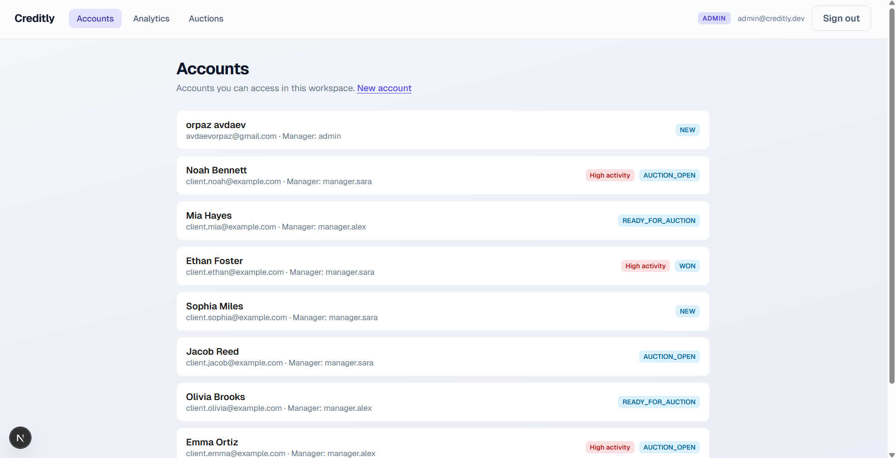

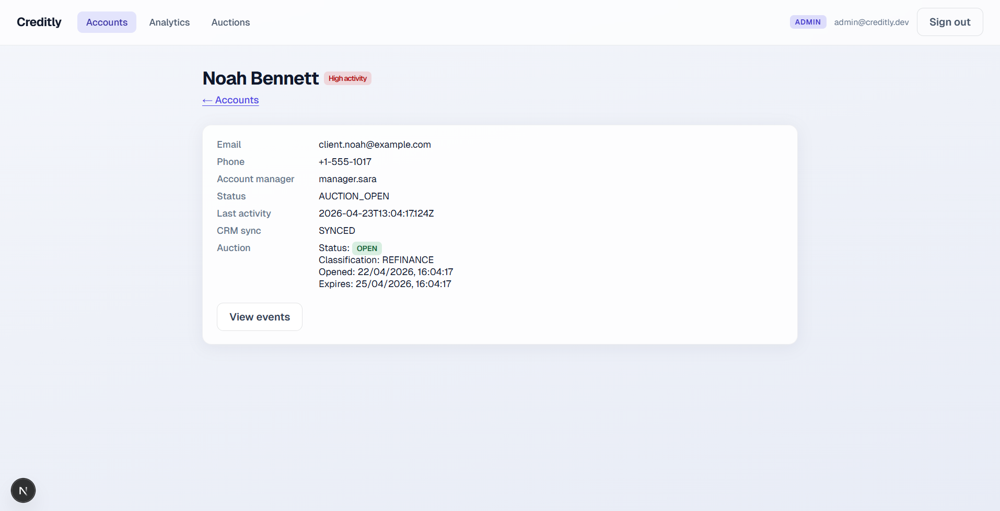

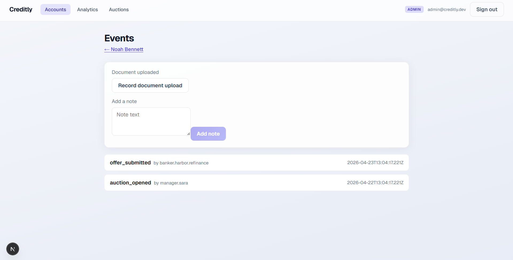

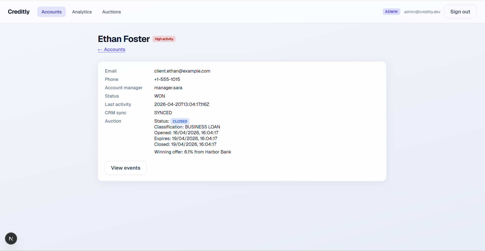

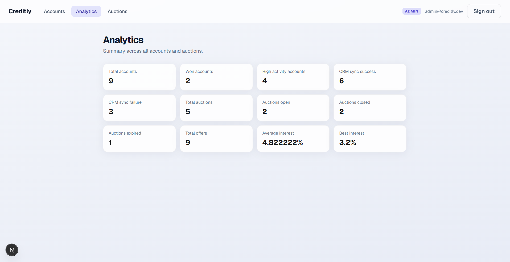

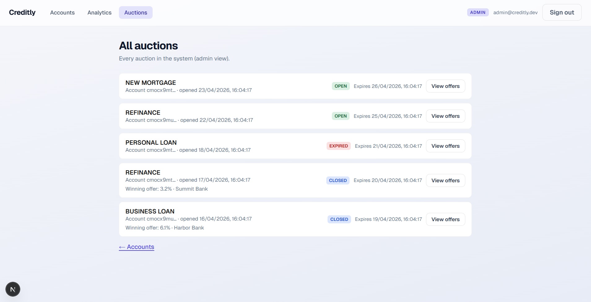

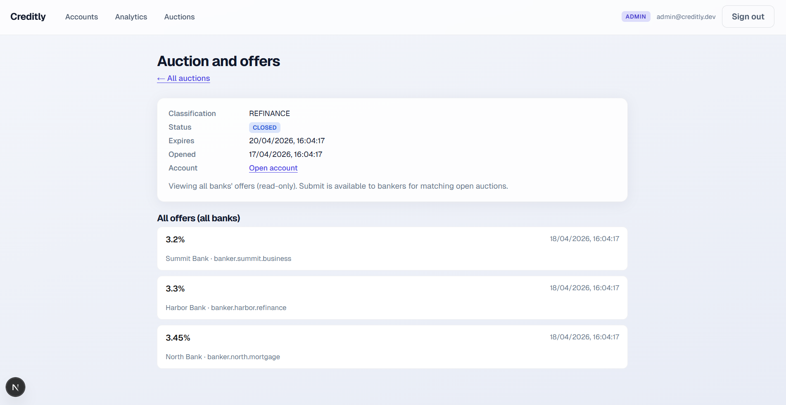

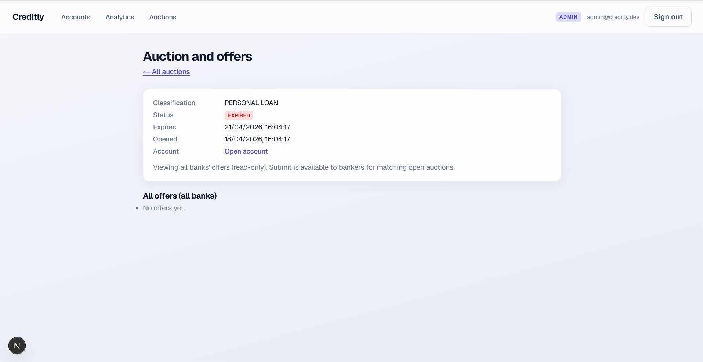

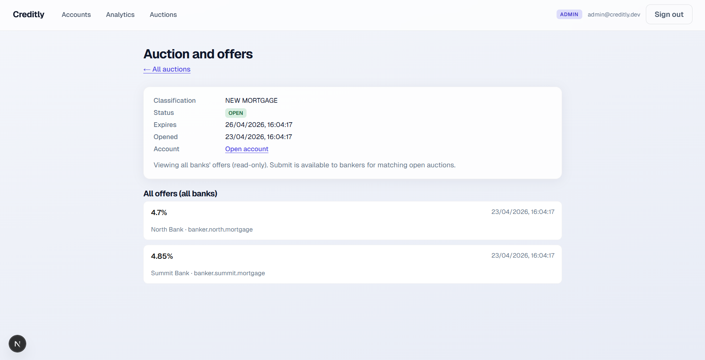

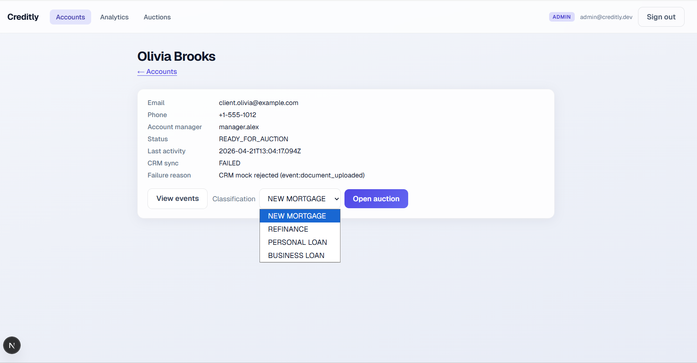

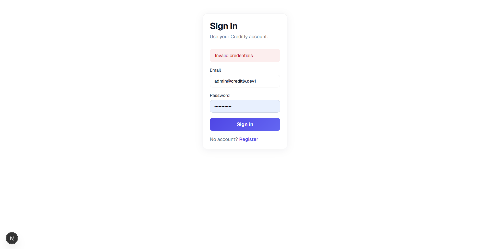

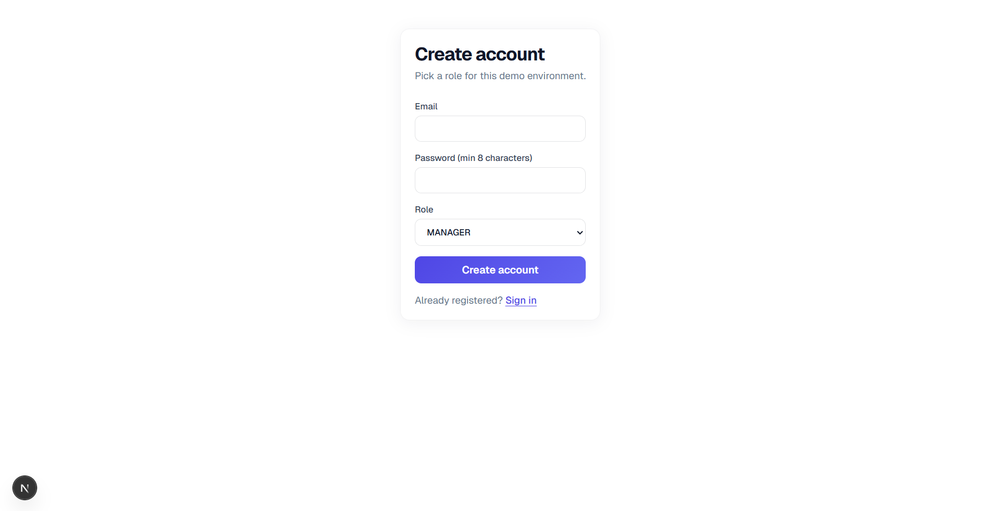

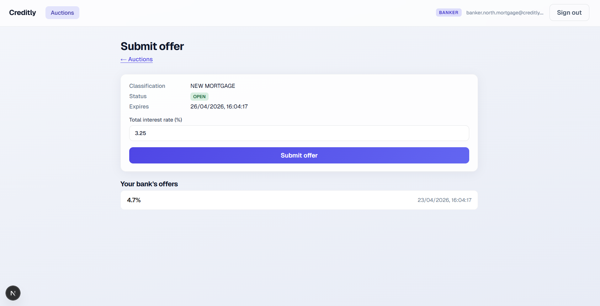

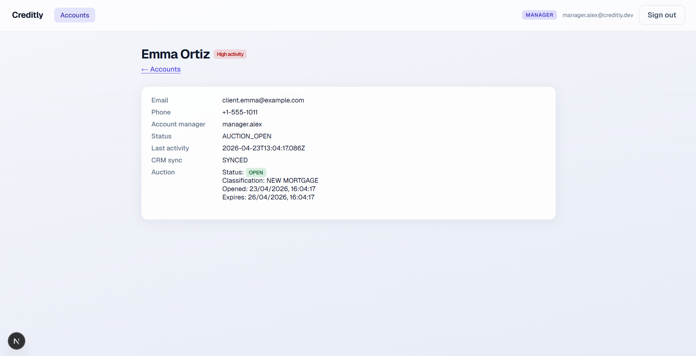

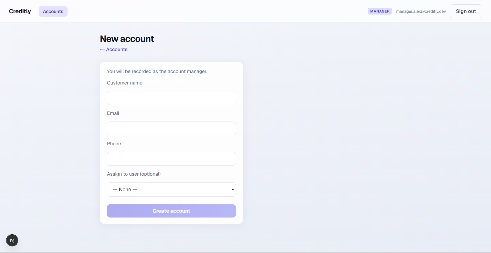

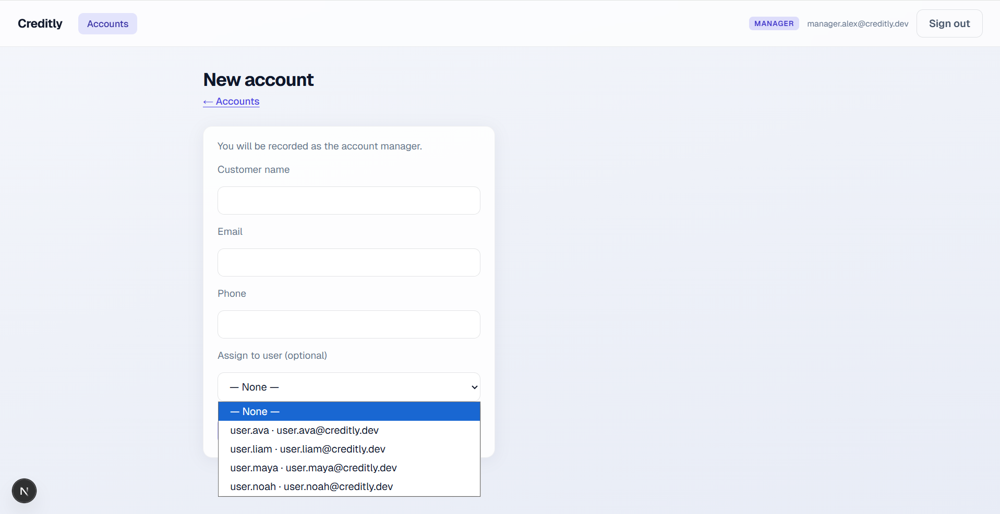


---
### Backend class reference, roles, and relationships

Classes are used for **constructor injection**: each type holds its collaborators as **`private readonly`** fields. There is **no shared base class** for controllers, services, or repositories.

**Where instances are wired**

- **`createApp`** (`backend/src/app.ts`) — Builds repositories and services, attaches **one shared `EventBus`** (default **`appEventBus`**) to anything that publishes **`ACCOUNT_EVENT_CREATED`** notifications, nests **controllers → services → repositories** for each HTTP mount, and accepts an optional **`EventSideEffectService`** (with **`EventSideEffectRepository`**) for tests.
- **`registerEventBusListeners`** (`backend/src/event-bus/register-listeners.ts`) — Creates **`AccountSyncRepository`**, **`MockCrmApiClient`**, **`CrmSyncService`**, and registers **`registerCrmOnAccountEventCreated`** plus the winning-offer listener (CRM runs **outside** `createApp` but uses the same bus singleton).
- **`startRefreshTokenCleanupJob`** — Instantiates **`AuthRepository`** for expired refresh-token deletes.

**Typical request flow**

`modules/*` routes apply middleware, then call a **controller** method. The controller parses path/query, calls **one service** (or a small set), maps the result to JSON. The service enforces rules and RBAC helpers, calls **repositories** and sometimes **`EventBus`** / **`EventSideEffectService`**. Repositories are the only layer that use **Prisma** directly.

**Controllers** (HTTP adapter only; no Prisma)

| Class | Responsibility |
| -------- | ---------------- |
| **`AuthController`** | Login, refresh, register; delegates to **`AuthService`**. |
| **`AnalyticsController`** | Admin analytics endpoint; delegates to **`AnalyticsService`**. |
| **`UserController`** | Admin/manager user listing tied to **`AuthRepository`**. |
| **`AccountController`** | Account CRUD, list, detail, open auction on account; orchestrates **`AccountAuctionService`**, **`AccountListService`**, **`AccountCreateService`**. |
| **`AuctionController`** | Auction list (staff/banker) and close auction; uses **`AuctionCloseService`** and **`AuctionBrowseService`**. |
| **`AuctionOfferController`** | List offers and submit offer; delegates to **`AuctionOfferService`**. |
| **`EventController`** | List and create timeline events; delegates to **`EventService`**. |

**Services** (use cases, validation, RBAC, orchestration)

| Class | Responsibility |
| -------- | ---------------- |
| **`AuthService`** | Register, login, refresh token rotation; uses **`AuthRepository`** and env-driven JWT/cookie settings. |
| **`AnalyticsService`** | Aggregates admin-only metrics via **`AnalyticsRepository`**. |
| **`AccountAccessService`** | **`assertStaffCanAccessAccount`** and manager/admin variants; uses **`AccountRepository`** for lookups and assignment checks. |
| **`AccountListService`** | Scoped **`GET /accounts`** and **`GET /accounts/:id`**; combines **`AccountRepository`**, **`AccountAccessService`**, **`AuctionLifecycleRepository`** for summaries. |
| **`AccountCreateService`** | Creates accounts (and optional linked user); **`AccountRepository`** + **`AuthRepository`**. |
| **`AccountAuctionService`** | Opens an auction for an account (events, lifecycle, **`EventSideEffectService`**, **`EventBus`**). |
| **`AuctionBrowseService`** | Resolves auction list rows for staff vs banker (with **`AuctionBrowseRepository`** and lifecycle expiry helpers). |
| **`AuctionCloseService`** | Manager/admin close path: lifecycle writes, **`AUCTION_CLOSED`** event, **`EventSideEffectService`**, then **`publishAccountEventCreated`**. |
| **`AuctionOfferService`** | Banker submit offer: validation, **`AuctionOfferRepository`**, lifecycle expiry, **`EventSideEffectService`**, **`EventBus`**. |
| **`EventService`** | Staff event create/list: **`EventRepository`**, **`AccountAccessService`**, **`EventSideEffectService`**, **`EventBus`**. |
| **`EventSideEffectService`** | Central **synchronous** reactions after a persisted **`Event`**: account status, high activity, auction win/expire side effects; uses **`EventSideEffectRepository`** and may **`emit`** winning-offer topic on the bus. |
| **`CrmSyncService`** | **Asynchronous** CRM orchestration from bus listeners only (implementation in **`integration/crm/crm-sync.service.ts`**): calls injected **`CrmApiClient`**, then **`AccountSyncRepository`** for sync state. |

**Repositories** (persistence only)

| Class | Responsibility |
| -------- | ---------------- |
| **`AuthRepository`** | Users, refresh tokens (hash at rest), auth queries for **`AuthService`**. |
| **`AnalyticsRepository`** | Read models for analytics. |
| **`AccountRepository`** | Accounts, assignments, manager links for list/detail/access. |
| **`AccountAuctionRepository`** | Open auction transaction boundary for an account. |
| **`AccountSyncRepository`** | Updates **`Account.syncStatus`** / **`failureReason`** after CRM attempts. |
| **`AuctionLifecycleRepository`** | Auction rows, expiry, close, domain **`Event`** inserts for auction lifecycle. |
| **`AuctionBrowseRepository`** | Queries behind banker/staff auction lists. |
| **`AuctionOfferRepository`** | Offer persistence and banker-scoped reads for submit/list. |
| **`EventRepository`** | Append and read **`Event`** rows. |
| **`EventSideEffectRepository`** | Multi-step Prisma updates for business rules triggered by event types (account state, offers, auctions). |

**Infrastructure and errors**

| Class | Responsibility |
| -------- | ---------------- |
| **`EventBus`** | In-process **`on` / `emit`**; shared across **`createApp`**, **`EventSideEffectService`**, and **`registerEventBusListeners`**. |
| **`MockCrmApiClient`** | Implements **`CrmApiClient`**: simulated async CRM push with configurable failure rate. |
| **`HttpError`** | **`extends Error`**: typed **`status`** and **`code`** for the global error middleware. |

**Relationship sketch (composition, not inheritance)**

- **Controllers** depend only on **services** (and sometimes env for routers). They do **not** depend on repositories or **`EventBus`** directly, except indirectly through services.
- **`AccountAccessService`** is reused anywhere an account id must be checked for **ADMIN / MANAGER / USER** (and to reject **BANKER** on staff account APIs).
- **`EventSideEffectService`** is shared by **`EventService`**, **`AccountAuctionService`**, **`AuctionCloseService`**, and **`AuctionOfferService`** so event-driven business rules stay in one place.
- **`AuctionLifecycleRepository`** is shared by list, browse, close, and offer flows so auction state and expiry stay consistent.
- **`CrmSyncService`** is **not** constructed in **`createApp`**; it listens on the same **`EventBus`** instance after **`EventSideEffectService`** and HTTP paths have persisted work.

---

## Database design

**SQL** was chosen for this project because the system is fundamentally built around structured, highly related data such as accounts, users, auctions, offers, and audit events. 

These entities have clear relationships and business rules that must be enforced consistently, and a relational database like **PostgreSQL** provides strong guarantees around data integrity, transactions, and consistency (ACID - means that every operation in the database must preserve all defined rules and constraints, ensuring the system always remains in a valid and reliable state before and after each transaction), which are critical in a financial context where incorrect or partial data is not acceptable.


At the same time, SQL enables efficient querying across relationships, making it well-suited for features like dashboards, audit trails, and complex filtering (for example, retrieving all offers for an account or tracking historical events). This aligns naturally with the needs of this project, where both operational workflows and data analysis are important.


The main tradeoff is reduced flexibility compared to NoSQL solutions: schema changes require planning and migrations, and scaling horizontally can be more complex. In addition, highly dynamic or unstructured data can be less convenient to model. However, in this case, the benefits of strong consistency, relational integrity, and reliable transactions clearly outweigh these limitations, making SQL the more appropriate choice for the system.

**Prisma** is used as the ORM (Object-Relational Mapping) layer between the application and the database, providing a type-safe and structured API instead of writing raw SQL queries. This improves developer productivity through auto-generated types, reduces runtime errors, and helps maintain consistency between the database schema and the application code. In addition, Prisma adds a layer of security by preventing common vulnerabilities such as SQL injection, since queries are parameterized by default and not constructed manually.

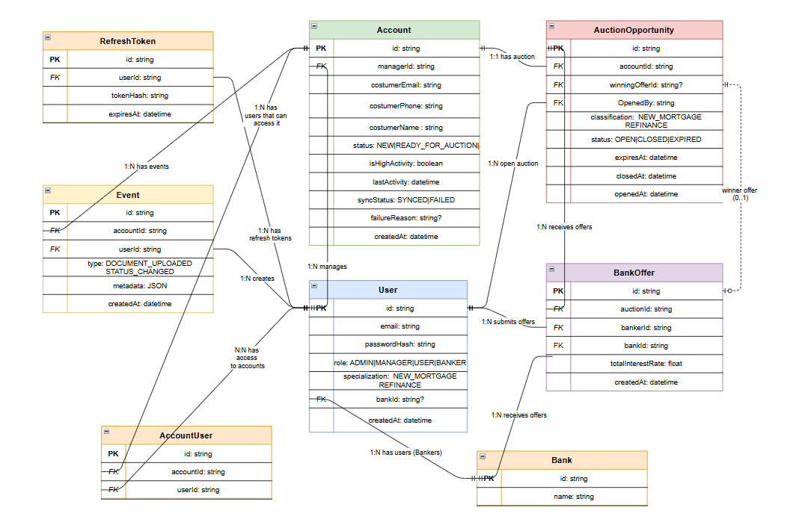
---

## Role-based access control (RBAC)

**Roles**

- **`ADMIN`** — Full staff visibility where middleware allows it; **resource checks** still apply on account-scoped routes (see below).
- **`MANAGER`** — Owns accounts (`Account.managerId`); opens and closes auctions for those accounts.
- **`USER`** — Access only to **assigned** accounts (`AccountUser`), and can create document_uploaded and note_added events.
- **`BANKER`** — Participates in auctions and offers; **must not** see account lists, account detail, or customer PII through staff APIs.

**HTTP layer**

- **`authenticateJWT`** — Validates the Bearer access JWT and sets `req.user` (`id`, `email`, `role`).
- **`requireRole` / `requireRoles`** — Enforces allowed roles. By default **`ADMIN` bypasses** the allow-list (`allowAdminBypass` defaults to true). Some routes **disable** that bypass so only real bankers hit banker-only surfaces (for example `GET /auctions` and offer routes).

**Resource-level rules (`AccountAccessService`)**

Staff routes that touch a specific account (`/events`, account auctions, auction close, and similar) call **`assertStaffCanAccessAccount`**: bankers are rejected with **403**; unknown or out-of-scope accounts return **404** (to avoid leaking existence). **`ADMIN`** passes; **`MANAGER`** must match `managerId`; **`USER`** must appear in `AccountUser`.

**Event creation**

- **`DOCUMENT_UPLOADED`** and **`NOTE_ADDED`** may be created only by **`ADMIN`** or **`USER`** (after access checks). **`MANAGER`** receives **403** for those types even on owned accounts, matching the product rule that uploads and free-form notes are not manager-authored in this prototype.

**Account listing**

- **`GET /accounts`** — **`AccountListService`** rejects **`BANKER`** with **403**; other roles receive scoped lists.

- **`GET /accounts/:id`** — Same staff roles as the list; **`AccountListService.getById`** runs **`assertStaffCanAccessAccount`** then returns one account plus **optional auction summary** (status, expiry, classification). Matches the assignment API surface and avoids loading the full list for the detail page.

Together, RBAC is **defense in depth**: route guards for coarse role boundaries, services for data scope and blind-auction behavior.

---

## Blind auction model

The **blind** auction model was chosen to ensure fairness and reduce bias between participants by preventing them from seeing each other’s offers during the bidding process. This approach encourages more realistic and independent pricing, since each user submits their offer without being influenced by competitors’ bids or strategic manipulation. In the context of Creditly, where financial decisions and account evaluations are involved, this model helps create a more objective and trustworthy selection process for the winning offer, while also simplifying the logic of comparison since all bids are revealed only at the decision stage.

**What bankers see**
להסביר למה בחרתי בערכים בemum של classification

- **Auction list** (`GET /auctions`) returns only **`OPEN`** opportunities whose **`classification`** is in the banker’s **`specialisation`** array (assignment: bankers see **open**, eligible auctions only). Rows include **`id`**, **`classification`**, **`status`**, **`openedAt`**, **`expiresAt`**, **`closedAt`** — no `accountId`, no customer contact fields (`banker-auction-list.mapper`).
- **Offer submission** persists internally with `accountId` for integrity, but the **HTTP response** maps the related event through **`mapBankerSubmitOfferResponse`**, which **omits `accountId`** from the `event` object returned to the client.

**Rules**

- Bankers must match auction **`classification`** against their **`specialisation`** array.
- **One offer per banker per auction**; duplicates yield **409**.
- Auction must be **`OPEN`** and not past **`expiresAt`** at submission time; expiration can be applied lazily when interacting with that auction.

The database still stores foreign keys linking offers to accounts; **blindness is enforced at the API and authorization layers**, not by erasing relational data.

---

## Event-driven design
להסביר למה זה היה נכון ארכיטקטונית להשתמש בזה שם.
Two related concepts coexist:

1. **Persisted `Event` rows** — The audit **timeline** per account. Created through **`EventService`** (and other flows that write events). **`userId` on the row always comes from the authenticated user**, never from an untrusted body field.

2. **In-process `EventBus`** — After the row is written and **synchronous** side-effect rules complete, **`publishAccountEventCreated`** emits topic **`ACCOUNT_EVENT_CREATED`** (wire value **`event.created`**) with an **`AccountEventCreatedPayload`** so subscribers can run **without** bloating the HTTP handler.

**Order of operations (staff-created events via `POST /events`)**

- Persist the `Event` row.
- Run **`EventSideEffectService.applyOnEventCreated`** in **`EventService`** (same request): account readiness after **`DOCUMENT_UPLOADED`**, high-activity window, and any other rules tied to the new event type.
- Emit **`ACCOUNT_EVENT_CREATED`** for **asynchronous** subscribers only (today: **`MockCrmApiClient`** via **`CrmSyncService`** for eligible types).
- When **`DOCUMENT_UPLOADED`** moves an account from **`NEW` → `READY_FOR_AUCTION`**, **`EventSideEffectService`** also persists a **`STATUS_CHANGED`** `Event` row and emits another **`ACCOUNT_EVENT_CREATED`** (CRM may run twice in that request: upload, then status change). After an auction win, it similarly records **`STATUS_CHANGED`** for **`AUCTION_OPEN` → `WON`** before the winning-offer bus topic fires.

**Listeners** (registered in **`registerEventBusListeners`** before the app accepts traffic):

- **`ACCOUNT_EVENT_CREATED`** — **`CrmSyncService.handleAfterAccountEventCreated`** for **`DOCUMENT_UPLOADED`**, **`STATUS_CHANGED`**, and **`AUCTION_OPENED`** only (other types no-op). Failures set **`syncStatus`** / **`failureReason`** on the account.
- **`winning.offer.selected`** — **`CrmSyncService.handleWinningOfferSelected`** after a winning offer is recorded.

**Trade-off:** handlers run **after** the HTTP response path has committed the primary write; failures in subscribers are logged but do not roll back the `Event` row. See Assumptions and trade-offs.

---

## CRM outbound integration (mock)

**Layers**

- **`CrmApiClient`** (`integration/crm/mock-crm-api.client.ts`) — Small interface: **`push(accountId, ctx)`** returns a **`Promise`**. A real deployment would swap **`MockCrmApiClient`** for an HTTP client (Salesforce, HubSpot, internal CRM API) without changing **`CrmSyncService`**.
- **`MockCrmApiClient`** — Async **`push`** (yields on **`Promise.resolve()`** then may throw). Failure probability comes from **`CRM_FAILURE_RATE`** (see **`backend/.env.example`**; default **0.35** when unset). **`CrmSyncService`** does not read that env var; only the mock does.
- **`CrmSyncService`** — Application orchestration: filters account-event payloads with **`TRIGGER_EVENTS`**, builds a **`ctx`** string for logs and error messages, calls **`crmClient.push`**, then **`AccountSyncRepository`** **`markSynced`** / **`markFailed`**. Shared **`syncAccount`** implements one try/catch path so success and failure handling are not duplicated.
- **Event bus** — Listeners invoke **`CrmSyncService`** only; they never call **`MockCrmApiClient`** directly.


For **`winning.offer.selected`**, the same **`syncAccount`** path runs with **`ctx`** in the form **`winning_offer_selected:`** plus the winning offer id.

להסביר את השימוש בDI פה. 


## Token strategy

להשלים תרשים ולהסביר את הflow

להסביר על הcleanjob

| Artifact | Transport | Lifetime | Storage server-side |
| -------- | ----------- | -------- | -------------------- |
| **Access token** | `Authorization: Bearer` | Short (default **900s** via `ACCESS_TOKEN_EXPIRES_SECONDS`) | Not stored; JWT signed with `JWT_SECRET` |
| **Refresh token** | **HttpOnly** cookie (name from `REFRESH_TOKEN_COOKIE`, default `refreshToken`, path **`/auth`**) | Long (default **7 days** via `REFRESH_TOKEN_EXPIRES_DAYS`) | **SHA-256 hash** only in **`RefreshToken`** |

**Login** returns `{ accessToken, expiresIn }` and sets the refresh cookie. **Refresh** (`AuthService.refresh`) reads the cookie, resolves the matching **`RefreshToken`** row, **rotates** the refresh material, and returns a new access token. **Register** does not start a session (no tokens), so “identity exists” and “session started” stay distinct.

**Client guidance:** keep access tokens in **memory** where possible; avoid `localStorage` for refresh material because the cookie is already HttpOnly. **CORS** uses **`credentials: true`** and a configured **`CORS_ORIGIN`** so browsers send cookies only to the intended API origin.

### Refresh token rotation (what it means here)

**Rotation** means the refresh token presented by the client is **consumed**: it must not work again, and the server issues **new** refresh material (new random value, new hash stored, new cookie). That supports **one-time use** of each refresh token and limits replay if a token is stolen after rotation.

**Persistence in this codebase:** **`AuthService.refresh`** deletes the **`RefreshToken`** row for the hash that matched the cookie, then **`AuthRepository.createRefreshToken`** inserts a **new** row with the new hash. The implementation is **delete + insert**, not an in-place **UPDATE** of `tokenHash` on the same row. Either shape can be valid in other systems; what matters for “rotation” is invalidating the old secret and issuing a new one.

### Expiry semantics (sliding window)

On **login** and on every successful **refresh**, `expiresAt` is set to **approximately “now + `REFRESH_TOKEN_EXPIRES_DAYS`”** (`AuthService.refreshExpiryDate`). The new row’s **`expiresAt` is not copied** from the previous row.

That is a **sliding** refresh lifetime: each successful refresh starts a **new** validity horizon from that moment. If the client refreshes often (for example whenever the short-lived access token expires every **15 minutes**), the refresh token’s deadline **keeps moving forward** while the user stays active, so an **active** user does not naturally hit refresh-token expiry.

Users stop being able to refresh when **no successful refresh** occurs for longer than that horizon (cookie and DB row both reflect the same policy), when the **cookie is gone** (cleared browser data, other device, and so on), or when the **stored row is missing**. This stack does **not** add a separate **idle timeout** or an **absolute “max session age from first login”** on top of the sliding refresh row, if i had more time I would implement it. 

### Why refresh lookup and the cleanup job both exist

**Lookup** (`AuthRepository.findRefreshTokenByHash`) requires **`expiresAt` strictly in the future** as well as a matching hash. Expired rows therefore **cannot** be used to mint new access tokens, even if a row still exists.

The periodic **`startRefreshTokenCleanupJob`** deletes rows whose **`expiresAt` is already in the past**. That job is **housekeeping** (limit table growth from abandoned sessions, multiple logins, and similar), **not** the mechanism that enforces expiry at request time.

### Tradeoffs and how this fits common practice

**Aligned with widely used patterns**

- **Short-lived access tokens** plus a **separate refresh path** limits damage if an access token leaks (small exposure window).
- **Refresh token rotation** (invalidate old, issue new) is a common recommendation and a good base for stricter policies later (for example **reuse detection** and revoking a **family** of tokens if an old refresh is presented again).

**Sliding refresh expiry**

- **Pros:** straightforward “stay signed in while you use the app” behavior; fewer surprise logouts during active use.
- **Cons:** an **active** session can continue **indefinitely** from the refresh mechanism alone; risk is bounded by how long a **stolen refresh cookie** remains usable if the attacker refreshes before the victim notices.

**Stronger or more regulated systems often add** (not implemented here unless you extend the code)

- **Absolute maximum session lifetime** (force sign-in again after N days from login even if refresh keeps succeeding).
- **Idle timeout** (require re-auth after no API activity for M minutes or hours), which is **orthogonal** to refresh TTL.
- **Refresh reuse / theft handling** (detect presentation of an already-rotated refresh token and revoke related sessions).
- **Binding** (cryptographically tie refresh usage to a client or device) when the threat model warrants the complexity.

There is no single universal “best practice”; the right balance depends on **risk**, **compliance**, and **UX**. This prototype leans toward **convenience** and **standard JWT + HttpOnly refresh** mechanics; tighten the model when the product requires stricter session bounds.

---

## Prisma and schema evolution (no committed migrations)

This repository ships **`prisma/schema.prisma`** and uses **`prisma db push`** (`npm run db:push`) to align a **development** database with the schema **without** generating SQL migration history.

**Why no `prisma/migrations` folder**

- Early-stage and demo-friendly: schema changes apply quickly, with less merge friction on migration files.
- Disposable local databases match the model in seconds.

**What I would do for production**

- Introduce **versioned migrations** (`prisma migrate dev` in development, **`prisma migrate deploy`** in CI/CD) once the schema stabilizes. Migrations give repeatable, reviewable DDL, auditable rollouts, and safe evolution on shared databases.


---

## Request validation (Zod)

`backend/src/validation/schemas.ts` defines payloads and path/query shapes. **`parseBody`**, **`parseParams`**, and **`parseQuery`** (`validation/parse-body.ts`) throw **`HttpError`** **400** with codes **`invalid_body`**, **`invalid_params`**, or **`invalid_query`** (first Zod issue message where helpful).

| Surface | Schema / helper | Where it runs |
| -------- | ----------------- | ------------- |
| `POST /auth/login` | `LoginBodySchema` | `AuthService.login` |
| `POST /auth/register` | `RegisterBodySchema` | `AuthService.register` |
| `POST /events` | `EventCreateBodySchema` (strict; `type` is `document_uploaded` \| `note_added` only) | `EventService.create` |
| `GET /events?accountId=` | `EventsListQuerySchema` + `firstQueryString` | `EventController.list` |
| `GET/POST …/:id…` (accounts, auctions) | `PathAccountIdSchema`, `PathAuctionIdSchema` | Account, auction, offer controllers |
| `POST /accounts/:id/auctions` | `OpenAuctionBodySchema` (strict; optional `classification`) | `AccountAuctionService.createForAccount` |
| `POST /auctions/:id/offers` | `SubmitOfferBodySchema` (`totalInterestRate` coerced number, finite, positive) | `AuctionOfferService.submitOffer` |

---

## Assumptions and trade-offs

- **Auth sessions** — Refresh tokens use rotation with a sliding expiration model, meaning each refresh extends the session lifetime. This improves user experience by keeping active users logged in without interruption. The tradeoff is that there is no absolute session limit, so a long-lived active session can theoretically persist indefinitely until revoked manually or invalidated, which slightly increases long-term security exposure compared to a hard session cap.
- **In-process event bus** — The system uses an in-memory event bus for simplicity and performance, enabling fast event propagation within the same Node process. The tradeoff is reduced reliability: if the process crashes after an event is emitted, side effects (such as CRM sync or DB updates) may be lost. A production upgrade would involve an external queue or outbox pattern for guaranteed delivery.
- **SQL vs NoSQL decision** — The choice is detailed in the DB design section, but the main tradeoff is structured consistency and relational integrity (SQL) versus schema flexibility and horizontal scalability (NoSQL). SQL was prioritized due to strong transactional and relational requirements.
- **Document upload / notes** — Document and note events are modeled conceptually without a dedicated storage layer or blob system. This simplifies the architecture and keeps the scope focused, but the tradeoff is reduced realism compared to a full production system where file storage and metadata separation would be required.
- **Error responses** — All non-HTTP errors are normalized into generic 500 responses to avoid leaking internal implementation details such as Prisma errors or stack traces. The tradeoff is reduced client-side error granularity, but improved security and system hardening.
- **Monolith process** — API, event listeners, and background jobs run within a single Node process for simplicity and fast development. This is appropriate for a bounded system scope and easier debugging, but the tradeoff is limited scalability and fault isolation. In production, these concerns would be split into separate services or workers.
- **Account eligibility logic** — An account becomes eligible for auctions only after document upload and reaching the READY_FOR_AUCTION state. This enforces a clear business rule that ensures only verified accounts enter financial workflows, improving data integrity and process correctness.
- **Event-driven architecture** — The system uses an event-driven approach to decouple actions (e.g. document upload, offer submission) from side effects like CRM sync or analytics updates. This improves extensibility and separation of concerns, but introduces complexity in debugging and potential eventual consistency tradeoffs.
- **Auction closedAt field** — The closedAt field is stored explicitly to represent the exact time an auction expires (e.g. three days after creation), instead of recalculating it dynamically from createdAt on every query. This improves performance and simplifies logic, especially for filtering auctions by status (open, closed, expired) and for analytics. The tradeoff is a small increase in storage and the need to ensure consistency between createdAt and closedAt, but in this case the benefit of avoiding repeated calculations and keeping queries efficient outweighs the cost.
- **Analytics design** — The selected analytics focus on operational visibility (e.g. total accounts, auction states, offer metrics, CRM sync success/failure). The tradeoff is that the system does not yet support deep ad-hoc analytics, but instead prioritizes predefined, business-relevant KPIs.
- **Admin restriction on bank offers** — Despite full RBAC permissions, admins are not allowed to create bank offers because they are not associated with a specific financial institution context. This enforces domain correctness over pure permission flexibility, preventing logically invalid system states.
- **User-account relationship model** — Users are allowed to be linked to accounts and perform actions directly on them without additional approval layers.
---

## What I would do in a larger scale and real production
 - **Message broker** — In a production-ready system, I would extract event handling into a dedicated message broker system such as Kafka. A message broker is a middleware that enables asynchronous communication between services by publishing events to topics and consuming them independently. Instead of tightly coupling event logic inside the main backend, producers would publish events (e.g. document_uploaded) to specific topics, and separate consumer services would process them (e.g. syncing with CRM or writing to the database). This improves scalability, separation of concerns, and fault tolerance, since the system can handle high throughput and grow the number of event types and consumers independently. It also reduces complexity in the core application logic and supports distributed processing at scale.
- **Rate limiting** — This mechanism controls how many requests a user can send within a given time window (e.g. 10 requests per hour). It is important in production systems to prevent abuse, protect backend resources, and ensure fair usage across users. In a system like this, it also adds a security layer against brute-force attacks and excessive API consumption.
- **APM** — APM tools such as Grafana (or similar observability platforms) provide real-time insights into system performance, including latency, error rates, and resource usage. In production, this would be essential for detecting bottlenecks, monitoring system health, and proactively identifying issues before they impact users.
- **Pagination** — Instead of returning large datasets in a single request, pagination allows data to be delivered in smaller chunks. This improves performance, reduces database load, and enhances user experience by only fetching what is needed at a time, especially for lists like accounts, events, or auctions.
- **Integration logs** — These logs track all interactions with external systems such as the CRM integration layer. They are critical for debugging synchronization issues, monitoring data consistency between systems, and ensuring traceability of external API calls in case of failures.
- **Districtive analytics colors** — Using visual indicators (e.g. colors for metrics or analytics values) helps highlight anomalies, trends, or important thresholds in the system. This improves usability by making data interpretation faster and more intuitive for end users and administrators.
- **Absolute max session age** — – Even if a refresh token is continuously rotated and valid, enforcing a hard maximum session duration (e.g. 30 days) ensures users are periodically re-authenticated. This improves security by limiting long-term session abuse and reducing risk from compromised tokens.
- **Role selection in registration** — Allowing users to choose their own role during registration introduces a security risk, as it could lead to privilege escalation. Instead, roles should be assigned by administrators to ensure proper access control and maintain the integrity of the RBAC system.
- **Manual account eligibility approval** — After document upload or account creation, an administrator manually reviews and approves the account before it becomes active. This introduces a human validation step, ensuring data quality, compliance, and preventing fraudulent or incomplete accounts from being used in the system.
- **Password expiry mechanism** — – Enforcing periodic password changes (e.g. every 30 days) increases security by limiting the lifetime of potentially compromised credentials. This is especially important in systems handling sensitive financial or personal data, as it reduces long-term exposure risk.


