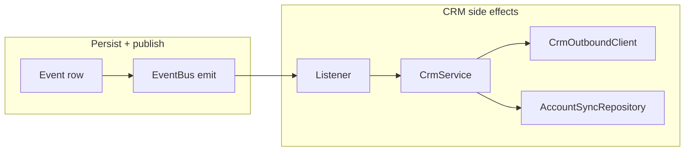

# Creditly

Creditly is a monorepo for a lending workflow prototype: internal staff manage **accounts** and **auctions**, while **bankers** participate in **blind** rate auctions without receiving customer-identifying data through the public API. The stack is **Express + Prisma + PostgreSQL** (API) and **Next.js App Router** (web), with an in-process event bus for reactions after domain events are persisted.

---

## Monorepo layout

| Package | Role |
| -------- | ---- |
| `backend/` | REST API, auth, RBAC, Prisma, domain services, in-process event bus |
| `frontend/` | Next.js UI, React Query, role-aware navigation and pages |

Each package installs and runs independently. The browser talks to the API via `NEXT_PUBLIC_API_URL` with credentials enabled for refresh cookies.

---

## Architecture

The backend follows a **layered** structure so HTTP, use cases, and persistence stay separated:

- **`index.ts` / `app.ts`** — Process bootstrap: load env, register event-bus listeners once, create Express app, start jobs (for example refresh-token cleanup), listen on a port.
- **`modules/`** — Route factories: mount paths, stack middleware (`authenticateJWT`, `requireRole` / `requireRoles`), delegate to controllers.
- **`controllers/`** — Map HTTP to service calls; **path and query** inputs use **Zod** via **`parseParams`** / **`parseQuery`** where applicable (`validation/`).
- **`services/`** — Use cases and orchestration; **Zod** validates inbound JSON bodies where the service owns the contract (auth, events, open auction, submit offer).
- **`repositories/`** — Prisma access and query shapes; keeps SQL/ORM details out of services.
- **`mappers/`** — API-facing DTOs (for example stripping fields for banker responses).
- **`event-bus/`** — Lightweight **in-process** pub/sub (`EventBus`: `on` / `emit`). Used for reactions after a row is written, not as a replacement for HTTP.
- **`middleware/`** — Auth, errors, request context.
- **Outbound integrations** — `src/integration/crm-mock.ts` defines **`CrmOutboundClient`** (contract) and **`CrmMockOutbound`** (simulated HTTP with configurable failure rate). **`CrmService`** depends on that interface only; **`registerEventBusListeners`** wires the mock. No controller imports the integration layer directly.
- **`jobs/`** — Scheduled in-process tasks.

The frontend uses the **App Router**, **React Query** for server state, a shared **`apiFetch`** helper, and **`AuthProvider`** for access tokens plus refresh via cookies.

### Backend class reference, roles, and relationships

Classes are used for **constructor injection**: each type holds its collaborators as **`private readonly`** fields. There is **no shared base class** for controllers, services, or repositories. **Inheritance** appears only on **`HttpError extends Error`** and **`CrmMockOutbound implements CrmOutboundClient`** (interface substitution for **`CrmService`**).

**Where instances are wired**

- **`createApp`** (`backend/src/app.ts`) — Builds repositories and services, attaches **one shared `EventBus`** (default **`appEventBus`**) to anything that publishes domain events, nests **controllers → services → repositories** for each HTTP mount, and accepts an optional **`DomainEventBusinessService`** for tests.
- **`registerEventBusListeners`** (`backend/src/event-bus/register-listeners.ts`) — Creates **`AccountSyncRepository`**, **`CrmMockOutbound`**, **`CrmService`**, and registers bus listeners (CRM runs **outside** `createApp` but uses the same bus singleton).
- **`startRefreshTokenCleanupJob`** — Instantiates **`AuthRepository`** for expired refresh-token deletes.

**Typical request flow**

`modules/*` routes apply middleware, then call a **controller** method. The controller parses path/query, calls **one service** (or a small set), maps the result to JSON. The service enforces rules and RBAC helpers, calls **repositories** and sometimes **`EventBus`** / **`DomainEventBusinessService`**. Repositories are the only layer that use **Prisma** directly.

**Controllers** (HTTP adapter only; no Prisma)

| Class | Responsibility |
| -------- | ---------------- |
| **`HealthController`** | Exposes liveness; delegates to **`HealthService`**. |
| **`AuthController`** | Login, refresh, register; delegates to **`AuthService`**. |
| **`AnalyticsController`** | Admin analytics endpoint; delegates to **`AnalyticsService`**. |
| **`UserController`** | Admin/manager user listing tied to **`AuthRepository`**. |
| **`AccountController`** | Account CRUD, list, detail, open auction on account; orchestrates **`AccountAuctionService`**, **`AccountListService`**, **`AccountCreateService`**. |
| **`AuctionController`** | Auction list (staff/banker) and close auction; uses **`AuctionCloseService`** and **`AuctionBrowseService`**. |
| **`AuctionOfferController`** | List offers and submit offer; delegates to **`AuctionOfferService`**. |
| **`EventController`** | List and create timeline events; delegates to **`EventService`**. |

**Services** (use cases, validation, RBAC, orchestration)

| Class | Responsibility |
| -------- | ---------------- |
| **`HealthService`** | Simple health check over **`HealthRepository`**. |
| **`AuthService`** | Register, login, refresh token rotation; uses **`AuthRepository`** and env-driven JWT/cookie settings. |
| **`AnalyticsService`** | Aggregates admin-only metrics via **`AnalyticsRepository`**. |
| **`AccountAccessService`** | **`assertStaffCanAccessAccount`** and manager/admin variants; uses **`AccountRepository`** for lookups and assignment checks. |
| **`AccountListService`** | Scoped **`GET /accounts`** and **`GET /accounts/:id`**; combines **`AccountRepository`**, **`AccountAccessService`**, **`AuctionLifecycleRepository`** for summaries. |
| **`AccountCreateService`** | Creates accounts (and optional linked user); **`AccountRepository`** + **`AuthRepository`**. |
| **`AccountAuctionService`** | Opens an auction for an account (events, lifecycle, **`DomainEventBusinessService`**, **`EventBus`**). |
| **`AuctionBrowseService`** | Resolves auction list rows for staff vs banker (with **`AuctionBrowseRepository`** and lifecycle expiry helpers). |
| **`AuctionCloseService`** | Manager/admin close path: lifecycle writes, **`AUCTION_CLOSED`** event, **`DomainEventBusinessService`**, then **`publishEventCreated`**. |
| **`AuctionOfferService`** | Banker submit offer: validation, **`AuctionOfferRepository`**, lifecycle expiry, **`DomainEventBusinessService`**, **`EventBus`**. |
| **`EventService`** | Staff event create/list: **`EventRepository`**, **`AccountAccessService`**, **`DomainEventBusinessService`**, **`EventBus`**. |
| **`DomainEventBusinessService`** | Central **synchronous** reactions after a persisted **`Event`**: account status, high activity, auction win/expire side effects; uses **`DomainEventBusinessRepository`** and may **`emit`** winning-offer topic on the bus. |
| **`CrmService`** | **Asynchronous** CRM orchestration from bus listeners only: calls injected **`CrmOutboundClient`**, then **`AccountSyncRepository`** for sync state. |

**Repositories** (persistence only)

| Class | Responsibility |
| -------- | ---------------- |
| **`HealthRepository`** | DB ping for health. |
| **`AuthRepository`** | Users, refresh tokens (hash at rest), auth queries for **`AuthService`**. |
| **`AnalyticsRepository`** | Read models for analytics. |
| **`AccountRepository`** | Accounts, assignments, manager links for list/detail/access. |
| **`AccountAuctionRepository`** | Open auction transaction boundary for an account. |
| **`AccountSyncRepository`** | Updates **`Account.syncStatus`** / **`failureReason`** after CRM attempts. |
| **`AuctionLifecycleRepository`** | Auction rows, expiry, close, domain **`Event`** inserts for auction lifecycle. |
| **`AuctionBrowseRepository`** | Queries behind banker/staff auction lists. |
| **`AuctionOfferRepository`** | Offer persistence and banker-scoped reads for submit/list. |
| **`EventRepository`** | Append and read **`Event`** rows. |
| **`DomainEventBusinessRepository`** | Multi-step Prisma updates for business rules triggered by event types (account state, offers, auctions). |

**Infrastructure and errors**

| Class | Responsibility |
| -------- | ---------------- |
| **`EventBus`** | In-process **`on` / `emit`**; shared across **`createApp`**, **`DomainEventBusinessService`**, and **`registerEventBusListeners`**. |
| **`CrmMockOutbound`** | Implements **`CrmOutboundClient`**: simulated async CRM push with configurable failure rate. |
| **`HttpError`** | **`extends Error`**: typed **`status`** and **`code`** for the global error middleware. |

**Relationship sketch (composition, not inheritance)**

- **Controllers** depend only on **services** (and sometimes env for routers). They do **not** depend on repositories or **`EventBus`** directly, except indirectly through services.
- **`AccountAccessService`** is reused anywhere an account id must be checked for **ADMIN / MANAGER / USER** (and to reject **BANKER** on staff account APIs).
- **`DomainEventBusinessService`** is shared by **`EventService`**, **`AccountAuctionService`**, **`AuctionCloseService`**, and **`AuctionOfferService`** so event-driven business rules stay in one place.
- **`AuctionLifecycleRepository`** is shared by list, browse, close, and offer flows so auction state and expiry stay consistent.
- **`CrmService`** is **not** constructed in **`createApp`**; it listens on the same **`EventBus`** instance after **`DomainEventBusinessService`** and HTTP paths have persisted work.

---

## Database design

PostgreSQL is the system of record. Prisma models express the domain:

**Identity and org**

- **`User`** — `email` (unique), `passwordHash`, `role` (`ADMIN` \| `MANAGER` \| `USER` \| `BANKER`), optional `bankId`, `specialisation` (for bankers, aligned with product types).
- **`Bank`** — Lending institution; bankers belong to a bank.
- **`RefreshToken`** — Stores only a **hash** of the refresh token plus `userId` and `expiresAt` (see Token strategy).

**Accounts and access**

- **`Account`** — Customer-facing record: manager (`managerId`), contact fields (`costumerName`, `costumerEmail`, `costumerPhone`), `status` (`NEW` → `READY_FOR_AUCTION` → `AUCTION_OPEN` → `WON`), activity and CRM sync fields (`lastActivity`, `isHighActivity`, `syncStatus`, `failureReason`).
- **`AccountUser`** — Many-to-many **assignments** so a `USER` can collaborate on an account without being the manager.

**Audit timeline**

- **`Event`** — Append-only style log per account: `accountId`, `userId`, `type` (`EventType` enum), `metadata` (JSON), `createdAt`. Serves staff timelines and downstream automation.

**Auctions and offers**

- **`AuctionOpportunity`** — At most **one open auction per account** (`accountId` unique). Tracks `classification` (matches banker specialisation), `status` (`OPEN` \| `EXPIRED` \| `CLOSED`), `openedBy`, `openedAt`, `expiresAt`, `closedAt`, optional `winningOfferId`.
- **`BankOffer`** — A banker’s single bid: `totalInterestRate`, `bankId`, `bankerId`, link to auction. Uniqueness of “one offer per banker per auction” is enforced in the offer transaction path.

**Enums** (`UserRole`, `Specialisation`, `AccountStatus`, `SyncStatus`, `EventType`, `AuctionOpportunityStatus`) keep states explicit in the schema and in Prisma Client types.

---

## Role-based access control (RBAC)

**Roles**

- **`ADMIN`** — Full staff visibility where middleware allows it; **resource checks** still apply on account-scoped routes (see below).
- **`MANAGER`** — Owns accounts (`Account.managerId`); opens and closes auctions for those accounts.
- **`USER`** — Access only to **assigned** accounts (`AccountUser`).
- **`BANKER`** — Participates in auctions and offers; **must not** see account lists, account detail, or customer PII through staff APIs.

**HTTP layer**

- **`authenticateJWT`** — Validates the Bearer access JWT and sets `req.user` (`id`, `email`, `role`).
- **`requireRole` / `requireRoles`** — Enforces allowed roles. By default **`ADMIN` bypasses** the allow-list (`allowAdminBypass` defaults to true). Some routes **disable** that bypass so only real bankers hit banker-only surfaces (for example `GET /auctions` and offer routes).

**Resource-level rules (`AccountAccessService`)**

Staff routes that touch a specific account (`/events`, account auctions, auction close, and similar) call **`assertStaffCanAccessAccount`**: bankers are rejected with **403**; unknown or out-of-scope accounts return **404** (to avoid leaking existence). **`ADMIN`** passes; **`MANAGER`** must match `managerId`; **`USER`** must appear in `AccountUser`.

**Event creation**

- **`DOCUMENT_UPLOADED`** and **`NOTE_ADDED`** may be created only by **`ADMIN`** or **`USER`** (after access checks). **`MANAGER`** receives **403** for those types even on owned accounts, matching the product rule that uploads and free-form notes are not manager-authored in this prototype.

**Account listing**

- **`GET /accounts`** — **`AccountListService`** rejects **`BANKER`** with **403**; other roles receive scoped lists.

- **`GET /accounts/:id`** — Same staff roles as the list; **`AccountListService.getById`** runs **`assertStaffCanAccessAccount`** then returns one account plus **optional auction summary** (status, expiry, classification). Matches the assignment API surface and avoids loading the full list for the detail page.

Together, RBAC is **defense in depth**: route guards for coarse role boundaries, services for data scope and blind-auction behavior.

---

## Blind auction model

A **blind** auction here means bankers compete on **rate** and **timing** without the API disclosing **which customer** an auction belongs to.

**What bankers see**

- **Auction list** (`GET /auctions`) returns only **`OPEN`** opportunities whose **`classification`** is in the banker’s **`specialisation`** array (assignment: bankers see **open**, eligible auctions only). Rows include **`id`**, **`classification`**, **`status`**, **`openedAt`**, **`expiresAt`**, **`closedAt`** — no `accountId`, no customer contact fields (`banker-auction-list.mapper`).
- **Offer submission** persists internally with `accountId` for integrity, but the **HTTP response** maps the related event through **`mapBankerSubmitOfferResponse`**, which **omits `accountId`** from the `event` object returned to the client.

**Rules**

- Bankers must match auction **`classification`** against their **`specialisation`** array.
- **One offer per banker per auction**; duplicates yield **409**.
- Auction must be **`OPEN`** and not past **`expiresAt`** at submission time; expiration can be applied lazily when interacting with that auction.

**Closing and outcomes**

- Staff (**`MANAGER`** / **`ADMIN`**) close an auction via **`POST /auctions/:id/close`**, which records an **`AUCTION_CLOSED`** domain event, then runs **`DomainEventBusinessService.applyOnEventCreated`** in the same request (winner selection or finalize no-bid paths) before **`event.created`** is emitted for audit subscribers (**CRM** does not sync on **`AUCTION_CLOSED`**; winning path uses **`winning.offer.selected`**).
- **Winner selection**: among offers, lowest **`totalInterestRate`** wins; ties break on **earliest `createdAt`** (repository `orderBy`).
- **No offers**: auction becomes **`EXPIRED`** (not **`CLOSED`** / no **`WON`** on the account). **With offers**: auction **`CLOSED`**, **`winningOfferId`** set, account **`WON`**.

The database still stores foreign keys linking offers to accounts; **blindness is enforced at the API and authorization layers**, not by erasing relational data.

---

## Event-driven design

Two related concepts coexist:

1. **Persisted `Event` rows** — The audit **timeline** per account. Created through **`EventService`** (and other flows that write events). **`userId` on the row always comes from the authenticated user**, never from an untrusted body field.

2. **In-process `EventBus`** — After the row is written and **synchronous** domain reactions complete, **`publishEventCreated`** emits **`event.created`** with a **`DomainEventCreatedPayload`** so subscribers can run **without** bloating the HTTP handler.

**Order of operations (staff-created events via `POST /events`)**

- Persist the `Event` row.
- Run **`DomainEventBusinessService.applyOnEventCreated`** in **`EventService`** (same request): account readiness after **`DOCUMENT_UPLOADED`**, high-activity window, and any other rules tied to the new event type.
- Emit **`event.created`** for **asynchronous** subscribers only (today: **CRM mock** for eligible types).

**Listeners** (registered in **`registerEventBusListeners`** before the app accepts traffic):

- **`event.created`** — **`CrmService.handleAfterDomainEvent`** for **`DOCUMENT_UPLOADED`**, **`STATUS_CHANGED`**, and **`AUCTION_OPENED`** only (other types no-op). Failures set **`syncStatus`** / **`failureReason`** on the account.
- **`winning.offer.selected`** — **`CrmService.handleWinningOfferSelected`** after a winning offer is recorded.

**Trade-off:** handlers run **after** the HTTP response path has committed the primary write; failures in subscribers are logged but do not roll back the `Event` row. See Assumptions and trade-offs.

---

## CRM outbound integration (mock)

**Layers**

- **`CrmOutboundClient`** (`integration/crm-mock.ts`) — Small interface: **`push(accountId, ctx)`** returns a **`Promise`**. A real deployment would swap **`CrmMockOutbound`** for an HTTP client (Salesforce, HubSpot, internal CRM API) without changing **`CrmService`**.
- **`CrmMockOutbound`** — Async **`push`** (yields on **`Promise.resolve()`** then may throw). Failure probability comes from **`CRM_FAILURE_RATE`** (see **`backend/.env.example`**; default **0.35** when unset). **`CrmService`** does not read that env var; only the mock does.
- **`CrmService`** — Application orchestration: filters domain events with **`TRIGGER_EVENTS`**, builds a **`ctx`** string for logs and error messages, calls **`crmClient.push`**, then **`AccountSyncRepository`** **`markSuccess`** / **`markFailed`**. Shared **`syncAccount`** implements one try/catch path so success and failure handling are not duplicated.
- **Event bus** — Listeners invoke **`CrmService`** only; they never call **`CrmMockOutbound`** directly.

**Flow (high level)**



For **`winning.offer.selected`**, the same **`syncAccount`** path runs with **`ctx`** in the form **`winning_offer_selected:`** plus the winning offer id.

---

## Token strategy

| Artifact | Transport | Lifetime | Storage server-side |
| -------- | ----------- | -------- | -------------------- |
| **Access token** | `Authorization: Bearer` | Short (default **900s** via `ACCESS_TOKEN_EXPIRES_SECONDS`) | Not stored; JWT signed with `JWT_SECRET` |
| **Refresh token** | **HttpOnly** cookie (name from `REFRESH_TOKEN_COOKIE`, default `refreshToken`, path **`/auth`**) | Long (default **7 days** via `REFRESH_TOKEN_EXPIRES_DAYS`) | **SHA-256 hash** only in **`RefreshToken`** |

**Login** returns `{ accessToken, expiresIn }` and sets the refresh cookie. **Refresh** (`AuthService.refresh`) reads the cookie, resolves the matching **`RefreshToken`** row, **rotates** the refresh material, and returns a new access token. **Register** does not start a session (no tokens), so “identity exists” and “session started” stay distinct.

**Client guidance:** keep access tokens in **memory** where possible; avoid `localStorage` for refresh material because the cookie is already HttpOnly. **CORS** uses **`credentials: true`** and a configured **`CORS_ORIGIN`** so browsers send cookies only to the intended API origin.

### Refresh token rotation (what it means here)

**Rotation** means the refresh token presented by the client is **consumed**: it must not work again, and the server issues **new** refresh material (new random value, new hash stored, new cookie). That supports **one-time use** of each refresh token and limits replay if a token is stolen after rotation.

**Persistence in this codebase:** **`AuthService.refresh`** deletes the **`RefreshToken`** row for the hash that matched the cookie, then **`AuthRepository.createRefreshToken`** inserts a **new** row with the new hash. The implementation is **delete + insert**, not an in-place **UPDATE** of `tokenHash` on the same row. Either shape can be valid in other systems; what matters for “rotation” is invalidating the old secret and issuing a new one.

### Expiry semantics (sliding window)

On **login** and on every successful **refresh**, `expiresAt` is set to **approximately “now + `REFRESH_TOKEN_EXPIRES_DAYS`”** (`AuthService.refreshExpiryDate`). The new row’s **`expiresAt` is not copied** from the previous row.

That is a **sliding** refresh lifetime: each successful refresh starts a **new** validity horizon from that moment. If the client refreshes often (for example whenever the short-lived access token expires every **15 minutes**), the refresh token’s deadline **keeps moving forward** while the user stays active, so an **active** user does not naturally hit refresh-token expiry.

Users stop being able to refresh when **no successful refresh** occurs for longer than that horizon (cookie and DB row both reflect the same policy), when the **cookie is gone** (cleared browser data, other device, and so on), or when the **stored row is missing**. This stack does **not** add a separate **idle timeout** or an **absolute “max session age from first login”** on top of the sliding refresh row; those would be extra product or security rules if you need them.

### Why refresh lookup and the cleanup job both exist

**Lookup** (`AuthRepository.findRefreshTokenByHash`) requires **`expiresAt` strictly in the future** as well as a matching hash. Expired rows therefore **cannot** be used to mint new access tokens, even if a row still exists.

The periodic **`startRefreshTokenCleanupJob`** deletes rows whose **`expiresAt` is already in the past**. That job is **housekeeping** (limit table growth from abandoned sessions, multiple logins, and similar), **not** the mechanism that enforces expiry at request time.

### Tradeoffs and how this fits common practice

**Aligned with widely used patterns**

- **Short-lived access tokens** plus a **separate refresh path** limits damage if an access token leaks (small exposure window).
- **Refresh token rotation** (invalidate old, issue new) is a common recommendation and a good base for stricter policies later (for example **reuse detection** and revoking a **family** of tokens if an old refresh is presented again).

**Sliding refresh expiry**

- **Pros:** straightforward “stay signed in while you use the app” behavior; fewer surprise logouts during active use.
- **Cons:** an **active** session can continue **indefinitely** from the refresh mechanism alone; risk is bounded by how long a **stolen refresh cookie** remains usable if the attacker refreshes before the victim notices.

**Stronger or more regulated systems often add** (not implemented here unless you extend the code)

- **Absolute maximum session lifetime** (force sign-in again after N days from login even if refresh keeps succeeding).
- **Idle timeout** (require re-auth after no API activity for M minutes or hours), which is **orthogonal** to refresh TTL.
- **Refresh reuse / theft handling** (detect presentation of an already-rotated refresh token and revoke related sessions).
- **Binding** (cryptographically tie refresh usage to a client or device) when the threat model warrants the complexity.

There is no single universal “best practice”; the right balance depends on **risk**, **compliance**, and **UX**. This prototype leans toward **convenience** and **standard JWT + HttpOnly refresh** mechanics; tighten the model when the product requires stricter session bounds.

---

## Prisma and schema evolution (no committed migrations)

This repository ships **`prisma/schema.prisma`** and uses **`prisma db push`** (`npm run db:push`) to align a **development** database with the schema **without** generating SQL migration history.

**Why no `prisma/migrations` folder**

- Early-stage and demo-friendly: schema changes apply quickly, with less merge friction on migration files.
- Disposable local databases match the model in seconds.

**What you should do for production**

- Introduce **versioned migrations** (`prisma migrate dev` in development, **`prisma migrate deploy`** in CI/CD) once the schema stabilizes. Migrations give repeatable, reviewable DDL, auditable rollouts, and safe evolution on shared databases.

**Prisma 7 configuration**

- **`prisma.config.ts`** defines the datasource URL and wires **`prisma db seed`** to **`tsx prisma/seed.ts`**. Run **`npm run db:seed`** after push when you need deterministic demo data.

---

## Request validation (Zod)

`backend/src/validation/schemas.ts` defines payloads and path/query shapes. **`parseBody`**, **`parseParams`**, and **`parseQuery`** (`validation/parse-body.ts`) throw **`HttpError`** **400** with codes **`invalid_body`**, **`invalid_params`**, or **`invalid_query`** (first Zod issue message where helpful).

| Surface | Schema / helper | Where it runs |
| -------- | ----------------- | ------------- |
| `POST /auth/login` | `LoginBodySchema` | `AuthService.login` |
| `POST /auth/register` | `RegisterBodySchema` | `AuthService.register` |
| `POST /events` | `EventCreateBodySchema` (strict; `type` is `document_uploaded` \| `note_added` only) | `EventService.create` |
| `GET /events?accountId=` | `EventsListQuerySchema` + `firstQueryString` | `EventController.list` |
| `GET/POST …/:id…` (accounts, auctions) | `PathAccountIdSchema`, `PathAuctionIdSchema` | Account, auction, offer controllers |
| `POST /accounts/:id/auctions` | `OpenAuctionBodySchema` (strict; optional `classification`) | `AccountAuctionService.createForAccount` |
| `POST /auctions/:id/offers` | `SubmitOfferBodySchema` (`totalInterestRate` coerced number, finite, positive) | `AuctionOfferService.submitOffer` |

---

## Assumptions and trade-offs

- **Auth sessions** — Refresh tokens use **rotation** and a **sliding** `expiresAt` (see **Token strategy**). There is **no idle timeout** or **absolute max session age**; an active client that refreshes before the refresh window ends can stay signed in indefinitely until cookies or DB state change.
- **In-process event bus** — Simple and fast, but not durable: a crash after `emit` starts async work can drop side effects. Replacing with a queue or outbox would be the next step for hard reliability.
- **JWT claims** — `role` is fixed until refresh; revoking access for a compromised token before expiry may require a denylist or very short access TTL (not implemented here).
- **Blind auctions** — Privacy is enforced by **API design and RBAC**, not by removing relational integrity in the database.
- **Lazy auction expiration** — Some paths explicitly expire overdue auctions before reads/writes; there is no separate cron closing every auction at the exact second of `expiresAt`.
- **CRM** — Simulated random failures only; no real outbound integration or retry budget.
- **Document upload / notes** — Events can represent uploads and notes; there is no separate blob store or note table in this slice.
- **Error responses** — Non-HTTP errors are mapped to generic **500** responses so Prisma or stack traces are not leaked to clients (details stay in server logs where applicable).
- **Monolith process** — API, listeners, and cleanup job share one Node process; horizontal scaling would require externalizing sessions, bus, and jobs.

---

## Getting started

**Database**

```bash
cd backend
npm install
npm run db:up
npm run db:push
npm run db:seed
npm run dev
```

Default API: `http://localhost:3001` (see `backend/.env.example` for `DATABASE_URL`, `JWT_SECRET`, `CORS_ORIGIN`, token TTLs).

**Frontend**

```bash
cd frontend
npm install
npm run dev
```

Set `NEXT_PUBLIC_API_URL` in `frontend/.env` to the API origin (see `frontend/.env.example`).

---

## Scripts (reference)

| Location | Command | Purpose |
| -------- | ------- | ------- |
| `backend` | `npm run dev` | API with reload |
| `backend` | `npm run build` / `npm start` | Compile and run production |
| `backend` | `npm run test` | Vitest suite under `backend/tests/` (see **Testing** below) |
| `backend` | `npm run lint` / `npm run format` | ESLint / Prettier |
| `backend` | `npm run db:up` | Local Postgres (Docker Compose) |
| `backend` | `npm run db:push` | Apply schema (`prisma db push`) |
| `backend` | `npm run db:seed` | Seed demo data |
| `frontend` | `npm run dev` | Next.js dev server |
| `frontend` | `npm run build` / `npm start` | Production build and run |

`npm run build` in the backend runs **`prisma generate`** before **`tsc`**.

---

## Testing

The backend ships a **Vitest** suite (`cd backend && npm run test`). Tests are **unit-level** with **repository and integration boundaries mocked** so they run quickly without a database, while still exercising services, RBAC helpers, validation, and CRM orchestration.

**Why these areas are covered**

- **RBAC and data scope** — Wrong role or wrong account access is a security and compliance defect. Tests assert bankers cannot use staff account APIs, users and managers only see in-scope accounts, and event APIs reject disallowed roles.
- **Banker data minimization** — Offer responses must not leak `accountId` or customer identifiers to the banker client; a mapper test locks that contract.
- **Auction rules** — Submitting offers on non-open or expired auctions must fail with stable error codes; this protects integrity and matches UI expectations.
- **Domain reactions on events** — `DOCUMENT_UPLOADED` transitions **`NEW` → `READY_FOR_AUCTION`**, high-activity counts use a 24-hour window, and winner selection uses lowest rate then earliest offer; these are central business rules.
- **Event-driven CRM** — **`CrmService`** is tested with an injected **`{ push }`** stub (no real mock module); assertions cover success sync, failure persistence, unrelated event types, and the winning-offer path.

Together, the suite favors **short, readable tests** on **high-risk paths** rather than blanket coverage of every controller line.

---

## Environment

Secrets and deployment-specific values live in **`.env`** files, not in git. Copy **`backend/.env.example`** and **`frontend/.env.example`** and adjust for your machine or deployment.

Backend-only: **`CRM_FAILURE_RATE`** (0–1) tunes how often **`CrmMockOutbound.push`** throws in development; omit to use the default **0.35**.
